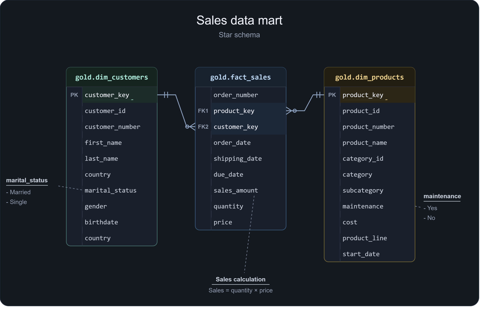

# sql-data-warehouse-project
Building a modern data warehouse with SQL Server, including ETL processes, data modeling, and analytics.
## 🏗️ Data Architecture

The data architecture for this project follows Medallion Architecture **Bronze**, **Silver**, and **Gold** layers:


1. **Bronze Layer**: Stores raw data as-is from the source systems. Data is ingested from CSV Files into SQL Server Database.
2. **Silver Layer**: This layer includes data cleansing, standardization, and normalization processes to prepare data for analysis.
3. **Gold Layer**: Houses business-ready data modeled into a star schema required for reporting and analytics.

---
## 📖 Project Overview

This project involves:

1. **Data Architecture**: Designing a Modern Data Warehouse Using Medallion Architecture **Bronze**, **Silver**, and **Gold** layers.
2. **ETL Pipelines**: Extracting, transforming, and loading data from source systems into the warehouse. Data Lineage shown below:



4. **Data Modeling**: Developing fact and dimension tables optimized for analytical queries. Star Schema Model shown below:



5. **Analytics & Reporting**: Creating SQL-based reports and dashboards for actionable insights.

---

## 🚀 Project Requirements

### Building the Data Warehouse (Data Engineering)

#### Objective
Develop a modern data warehouse using SQL Server to consolidate sales data, enabling analytical reporting and informed decision-making.

#### Specifications
- **Data Sources**: Import data from two source systems (ERP and CRM) provided as CSV files.
- **Data Quality**: Cleanse and resolve data quality issues prior to analysis.
- **Integration**: Combine both sources into a single, user-friendly data model designed for analytical queries.
- **Scope**: Focus on the latest dataset only; historization of data is not required.
- **Documentation**: Provide clear documentation of the data model to support both business stakeholders and analytics teams.

---

### BI: Analytics & Reporting (Data Analysis)

#### Objective
Develop SQL-based analytics to deliver detailed insights into:
- **Customer Behavior**
- **Product Performance**
- **Sales Trends**

These insights empower stakeholders with key business metrics, enabling strategic decision-making.  

Data analytics portfolio project, raw dataset sourcing and Data Warehouse development has been done with the help and guidance of Baraa Salkini (Ex Data Engineering & Architect Head at Mercedes Banz AG)

## 📂 Repository Structure
```
sql-data-warehouse-project/
│
├── Data_Analysis/                      # Exploratory Data analysis(EDA), Portfolio Project and Dual Analytics Report
├── datasets/                           # Raw datasets used for the project (ERP and CRM data)
│
├── docs/                               # Project documentation and architecture details
│   ├── data_integration.svg            # Shows how tables are related
│   ├── data_lineage_dark_refined.svg   # Shows the lineage of data across all 3 layers
│   ├── medallion_architecture.svg      # High Level Architecture for the whole dta warehouse
│   ├── sales_data_mart_star_schema.png # Star Schema showing how fact connects to dimension tables in gold layer
│
├── scripts/                            # SQL scripts for ETL and transformations
│   ├── bronze/                         # Scripts for extracting and loading raw data
│   ├── silver/                         # Scripts for cleaning and transforming data
│   ├── gold/                           # Scripts for creating analytical models

│
├── README.md                           # Project overview and instructions
├── LICENSE                             # License information for the repository
├── .gitignore                          # Files and directories to be ignored by Git
└── requirements.txt                    # Dependencies and requirements for the project
```
---
